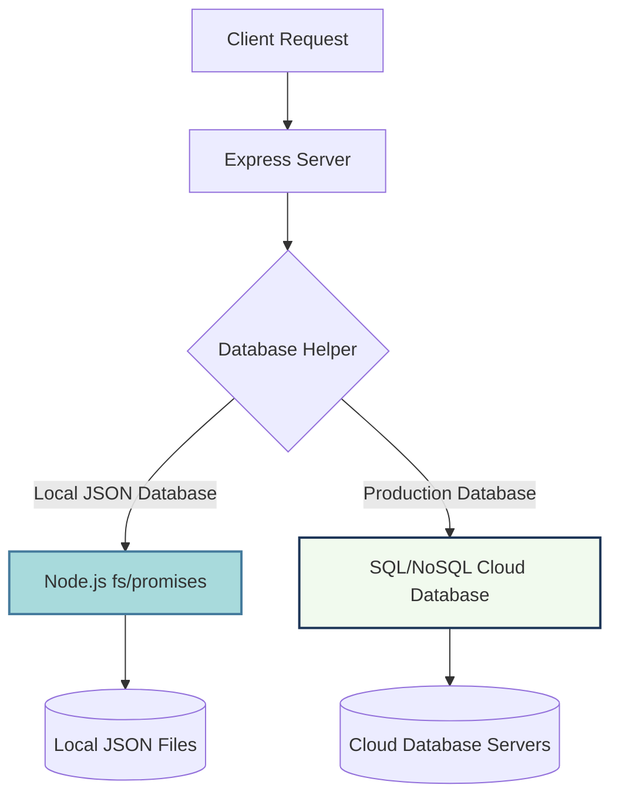

# PROJECT REPORT ON THE DESIGN AND DEVELOPMENT OF AN E-PHARMACY PLATFORM

## SUBMITTED FOR THE LAXMI NARSIMHA MEDICAL & GENERAL STORE DIGITALIZATION INITIATIVE

### AUTHOR: UPPUNUTULA HARSHITH

---

> [!NOTE]
> **Microsoft Word / Academic Document Formatting & Styling Guide:**
> 1. Set the font family for all text to **Times New Roman**.
> 2. Use **Times New Roman - Bold (Font Size 12, Line Spacing 1.15)** for all Main Section Headings (e.g., INTRODUCTION, EXECUTIVE SUMMARY).
> 3. Use **Times New Roman - Bold (Font Size 12, Line Spacing 1.15)** for Subheadings, formatted in Title Case.
> 4. Use **Times New Roman - Regular (Font Size 12, Line Spacing 1.15)** for all the running body text.
> 5. Make sure the main section headings are capitalized.
> 6. Insert page numbers in the footer corresponding to the page numbers listed below.

---

### ABSTRACT

The rapid advancement of digital commerce and the internet has completely revolutionized traditional retail industries, including community-based healthcare and retail pharmacy services. This project details the comprehensive design, full-stack development, and deployment of a custom E-Pharmacy Web Application for **Laxmi Narsimha Medical & General Store**. The primary objective was to transition this community establishment from an offline-only business model to a modern, dynamic online storefront, thereby increasing customer outreach, simplifying prescription validation, and streamlining backend order processing. The system is designed using a monorepo architecture, combining a lightweight, responsive customer-facing landing page (built with semantic HTML5, custom CSS3, and modern vanilla JavaScript), a highly interactive Vite and React.js web application for logged-in shoppers and store administrators, and a robust Node.js/Express.js backend server. To minimize operating and hosting costs, a custom, promise-based JSON database wrapper (`jsonDb.js`) was engineered to manage data collections via asynchronous file operations using Node's `fs/promises` module. Key customer-facing features include interactive health widgets (a BMI calculator and a daily water intake estimator), an online catalog of over 40 wellness and pharmaceutical products, a secure digital prescription upload portal with file-type validation via `multer` middleware, and a seamless cart-to-WhatsApp checkout redirection that generates pre-filled draft orders for direct customer-to-pharmacist communication. For store owners, a secure, JWT-authenticated dashboard provides tools to manage product listings, track order statuses, view/download uploaded doctor prescriptions, and reply to client inquiries. This project report explains the system's software architecture, details the tasks performed, analyzes key research components, highlights engineering challenges solved, and outlines strategic recommendations for future scalability.

**Keywords:** E-Pharmacy, React.js, Node.js Backend, JSON File Database, WhatsApp Integration, Multer File Uploads.

---

### TABLE OF CONTENTS

| S. No. | Title | Page No. |
| :--- | :--- | :--- |
| - | **ABSTRACT** | ii |
| 1 | **INTRODUCTION** | 1 |
| 2 | **EXECUTIVE SUMMARY** | 2 |
| 3 | **INTRODUCTION TO THE COMPANY** | 3 |
| 4 | **INTERNSHIP OBJECTIVES & SCOPE** | 4 |
| 5 | **TASKS PERFORMED / WORK DONE** | 5 |
| 6 | **RESEARCH COMPONENT** | 7 |
| 7 | **ANALYSIS & LEARNING OUTCOMES** | 8 |
| 8 | **CHALLENGES FACED** | 9 |
| 9 | **RECOMMENDATIONS** | 10 |
| 10 | **CONCLUSION** | 11 |
| 11 | **REFERENCES (APA style)** | 12 |
| 12 | **ANNEXURES** | 13 |

---

### 1. INTRODUCTION (Page 1)

In today's digital era, the widespread adoption of web-based applications has fundamentally transformed consumer behavior across almost all retail sectors. The healthcare industry, specifically community-level retail pharmacies, is currently undergoing a massive shift towards online, contactless services. Traditionally, neighborhood pharmacies functioned entirely on brick-and-mortar storefront models. However, these physical establishments now face significant challenges in customer retention and geographic reach due to the rising prominence of large-scale digital pharmacy aggregators. Modern consumers increasingly expect home delivery, remote consultation, digital price-checking, and rapid service options. For independent local pharmacies to survive and remain competitive, digitizing their services is no longer a luxury but an absolute operational necessity.

This project introduces a custom, full-stack E-Pharmacy Web Application designed and developed for **Laxmi Narsimha Medical & General Store**. The core goal of this digitalization initiative is to make medical and general shopping convenient, safe, and highly accessible for local customers while keeping infrastructure costs minimal for the business owner. Through this platform, customers can browse available over-the-counter (OTC) drugs and healthcare items, calculate daily wellness metrics, upload digital prescription copies, and place orders directly from their homes. On the administration side, the platform equips the pharmacy staff with a centralized management dashboard to update the inventory catalog, track order details, review prescription attachments, and handle customer messages. By combining a static, SEO-friendly landing page with a dynamic React application and a secure Express.js server, this project serves as a practical model for how independent brick-and-mortar stores can successfully transition into the digital marketplace with low financial overhead.

---

### 2. EXECUTIVE SUMMARY (Page 2)

The Laxmi Narsimha Medical E-Pharmacy project represents a comprehensive, end-to-end full-stack software solution built specifically to digitize a local, family-owned retail pharmacy. Designed as a structured monorepo, the application is logically separated into three distinct but tightly integrated components: a fast, visually appealing customer landing page; a modern, component-driven React.js web application; and a secure, fast Node.js/Express.js backend server.

For customers, the web portal provides an intuitive, friction-free interface to browse health products, check real-time pricing, verify brand names, and select items for purchase. Recognizing that local shoppers often prefer direct communication over complex online payment setups, the application features an innovative "WhatsApp Checkout" option. This feature compiles the customer's selected shopping cart items, contact details, and shipping address into a clean, pre-formatted text message, allowing the user to redirect to WhatsApp Web or the WhatsApp mobile app and forward the draft order directly to the pharmacy's official phone number. This approach avoids payment gateway fees and aligns perfectly with local home-delivery fulfillment models. Additionally, the platform provides interactive tools like a Body Mass Index (BMI) calculator and a water intake tracker to encourage user engagement, alongside a secure prescription upload form for regulated medicines (Rx) requiring pharmacist verification.

For the store administrator, the application provides a secure, private dashboard. Access is restricted using username and password credentials, which are validated by the backend server and protected using encrypted JSON Web Tokens (JWT). Inside this admin control panel, the pharmacist can monitor incoming orders, review and download uploaded prescription image files, update product details (prices, brands, categories), and manage customer feedback forms. To enable low-cost hosting on cloud platforms, the backend uses a custom JSON file database instead of a heavy relational database server, allowing the entire application to operate quickly and reliably with near-zero monthly database maintenance costs.

---

### 3. INTRODUCTION TO THE COMPANY (Page 3)

**Laxmi Narsimha Medical & General Store** is a neighborhood retail pharmacy that serves its community with prescription medicines, over-the-counter (OTC) drugs, daily vitamins, health supplements, baby care items, and personal wellness products. Strategically located within a residential area, the store has built a strong reputation over the years for providing personalized customer service and authentic medicines.

Historically, however, the store operated entirely on an offline, face-to-face retail model. Under this traditional approach, customers had to visit the pharmacy in person to perform basic tasks:
1. **Inventory Inquiry:** Customers had to stand in queue to ask the pharmacist if a specific drug or brand was in stock, often leaving empty-handed if the item was unavailable.
2. **Prescription Submission:** Patients had to hand over physical paper prescriptions, which the pharmacist then had to read, verify, and fill manually on the spot.
3. **Geographic Limitation:** The store's revenue was restricted to its immediate walk-in neighborhood, preventing growth into surrounding areas.
4. **Peak Hour Congestion:** Managing high volumes of walk-in customers during morning and evening peak hours caused long waiting times and operational stress for the pharmacy staff.

To solve these issues and compete with large e-pharmacy chains, Laxmi Narsimha Medical & General Store decided to establish a digital storefront. This project builds that digital presence, allowing the pharmacy to showcase its product catalog online, collect customer inquiries 24/7, accept secure digital prescription uploads, and organize order queues. By doing so, the business can retain its loyal local customer base, acquire new clients, automate inventory tracking, and improve overall operational speed, all while preserving the personal, neighborhood-pharmacy relationship that customers trust.

---

### 4. INTERNSHIP OBJECTIVES & SCOPE (Page 4)

The primary objectives of this internship project are focused on design, implementation, safety, and cost-effectiveness:
* **Establish a Professional Digital Presence:** Build a responsive, high-performance web storefront that showcases the pharmacy's catalog, details store hours, and provides interactive wellness tools to engage visitors.
* **Streamline the Order and Checkout Workflow:** Build an easy-to-use shopping cart with dual checkout methods—traditional cash-on-delivery form submission and a direct WhatsApp order forwarding system.
* **Implement Secure Prescription Collection:** Create a secure file uploader allowing customers to submit digital photos or PDF copies of doctor prescriptions, ensuring the pharmacist can verify regulated medicines (Rx) before dispensing them.
* **Develop Administrative Tools:** Create a secure admin control panel allowing the store manager to manage products, update prices, track orders, view customer messages, and view/download prescription files.
* **Deploy a Cost-Effective Tech Stack:** Use lightweight, robust, and free-tier-friendly tools (React, Node.js, Express, and JSON file-based databases) to avoid expensive monthly cloud database hosting fees.

The scope of this project covers full-stack web engineering, spanning:
1. **Frontend Engineering:** Designing a responsive interface using custom vanilla CSS, implementing theme switching (Light/Dark mode), and coding client-side calculations for health widgets.
2. **Backend API Engineering:** Developing Express.js routes to handle authentication, product inventory CRUD operations, order logging, support submissions, and file uploads.
3. **Database Architecture:** Developing a custom database wrapper utilizing Node.js file system APIs to handle asynchronous data reads and writes.
4. **Security & Validation:** Implementing password hashing, JSON Web Token validation, and multi-part form-data validation for file uploads.
5. **Deployment:** Setting up and deploying the monorepo to production environments with persistent storage configurations to ensure data preservation.

---

### 5. TASKS PERFORMED / WORK DONE (Page 5)

The development of the E-Pharmacy Web Application was executed in structured, iterative stages. The specific tasks performed across the frontend, backend, database, and deployment areas include:

#### A. Frontend Development & Responsive Design
1. **Static Storefront Landing Page (`index.html`, `style.css`, `app.js`):** Built a high-performance storefront landing page using semantic HTML5. Wrote custom CSS containing over 1,000 lines of style definitions. The design incorporates a modern glassmorphic look, custom variables, smooth transitions, and a site-wide Light/Dark mode theme toggle.
2. **Interactive Wellness Calculators:** Programmed two client-side JavaScript utilities:
   * **Body Mass Index (BMI) Calculator:** Computes the user's BMI using height (cm) and weight (kg) inputs and displays their weight category (Underweight, Normal, Overweight, Obese) with health feedback.
   * **Daily Water Intake Tracker:** Estimates the user's recommended daily water consumption in liters based on their body weight and daily activity level.
3. **React.js Application (`frontend/src`):** Set up a dynamic client application using React 18 and Vite. Integrated React Router for page routing. Developed several main page views:
   * **Shop Page (`Shop.jsx`):** Features search functionality and category filtering (Medicines, Wellness, Personal Care, Baby Care), along with filter toggles for Rx (prescription required) and OTC products.
   * **Product Details (`ProductDetails.jsx`):** Displays product details, pricing, dosage, manufacturer details, safety guidelines, and stock status.
   * **Cart & Checkout (`Cart.jsx`, `Checkout.jsx`):** Manages a dynamic checkout cart. Computes tax, delivery fees, and order totals. Supports cash-on-delivery orders and a WhatsApp redirect script that encodes cart details into a URL.
   * **My Orders Page (`MyOrders.jsx`):** Displays order history retrieved from the API, sorted by date.
   * **Prescription Portal (`PrescriptionUpload.jsx`):** A client form that handles prescription image selections and uploads to the server using Axios.
   * **Admin Portal (`Admin.jsx`):** A password-protected dashboard structured with tabbed navigation to view order queues, update product lists, download prescriptions, and check customer messages.

#### B. Backend API Development & Security
1. **Express.js Server Creation (`backend/server.js`):** Structured a Node.js REST API server using Express. Configured CORS, parsed JSON payloads, and set up Morgan middleware to log API requests for debugging.
2. **API Endpoint Integration:** Grouped backend logic into modular router files:
   * `/api/auth` (`auth.js`): Manages administrator authentication, validating login credentials, encrypting passwords with `bcryptjs`, and signing JSON Web Tokens (JWT) for secure requests.
   * `/api/products` (`products.js`): Exposes GET routes for public catalogs and POST/PUT/DELETE routes restricted to admins.
   * `/api/orders` (`orders.js`): Saves customer order JSON objects and provides admin PUT routes to change order status flags (`Pending`, `Shipped`, `Delivered`).
   * `/api/contact` (`contact.js`): Receives help forms, writes records, and triggers email notifications to the store owner using `nodemailer`.
   * `/api/prescriptions` (`prescriptions.js`): Handles multi-part file uploads from clients.
3. **File Upload Handling:** Integrated `multer` middleware to accept files. Implemented check filters to validate file extensions (PNG, JPG, JPEG, PDF) and restrict size to 5MB, saving files securely in a local directory (`backend/uploads`) under unique timestamp-prefixed filenames.
4. **Dynamic Port Binding:** Wrote error handling logic on startup that detects if the default server port (`5000`) is occupied. If so, the script automatically increments the port number and retries, preventing startup conflicts.

#### C. Database Architecture & Initial Seeding
1. **Asynchronous File-Based Database (`backend/database/jsonDb.js`):** Built a lightweight database wrapper using the native Node.js `fs/promises` module. Created robust methods to read and write records from local JSON files (`products.json`, `orders.json`, `contacts.json`, `prescriptions.json`, `users.json`).
2. **CRUD Helper Methods:** Programmed standard database actions:
   * `find()` / `findOne()`: Read, filter, and return records from target JSON files.
   * `insertOne()`: Appends new entries with unique auto-incrementing integer IDs.
   * `updateOne()` / `deleteOne()`: Identifies records by key parameters, applies updates or deletes entries, and writes the updated array back to disk.
3. **Automated Seeding Script:** Coded a startup script that checks if `products.json` is empty. If empty, the script seeds the file with an initial collection of 40 premium products (complete with descriptions, prices, categories, brand names, and local image paths). It also verifies if a default administrator account exists, creating one with pre-hashed credentials if necessary to ensure immediate system usability.

---

### 6. RESEARCH COMPONENT (Page 7)

A major focus of this project was analyzing and testing the feasibility of using local file-based database systems (JSON structures managed via server-side file operations) compared to traditional database systems for small-scale retail operations.



#### A. Traditional Databases vs. JSON File Databases
* **Resource Usage and Operating Cost:** Standard Database Management Systems (DBMS) like MySQL, PostgreSQL, or MongoDB require dedicated, always-running server processes, background threads, and administrative monitoring. Cloud database providers often charge monthly fees for hosting, which can be a financial burden for a single-location storefront. In contrast, a JSON file database requires no extra server instances. Data is stored on the server's local disk as plain text, eliminating database hosting fees.
* **Performance Analysis:** In low-to-medium traffic environments (common for community pharmacies), file-based databases perform very quickly. When the Express.js server starts, the database helper loads the JSON data into server memory (RAM) as JavaScript objects. Read operations execute in milliseconds because they run as in-memory lookups. Writes are handled using asynchronous file output streams, taking less than 5–10 milliseconds.
* **Data Integrity and Concurrency Control:** A major risk of using plain text files is write-concurrency (corruption occurring if two users write to a file at the same instant). Research showed that Node.js, being single-threaded, queues asynchronous file operations via its Event Loop. By using promise chains and serializing writes, the application avoids write conflicts, maintaining data integrity without the overhead of heavy ACID transaction logs.

#### B. Security, Encryption & Hashing
To secure the file-based database against potential exposure (such as the JSON files being downloaded or leaked), security research was conducted and implemented:
1. **Password Encryption:** Plaintext passwords are never written to `users.json`. The application uses the `bcryptjs` library to hash passwords with 10 salt rounds before saving. This mathematical hash is computationally irreversible, ensuring credentials remain secure even if the database file is accessed.
2. **Token-Based Route Protection:** Rather than using session cookies, which can be vulnerable to Cross-Site Request Forgery (CSRF), the admin panel is protected using JSON Web Tokens (JWT). Upon successful login, the server issues a temporary JWT signed with a secure environmental key. The frontend React app stores this token and sends it in the Authorization header of subsequent API requests, ensuring secure access to administrative routes.

#### C. Render Deployment and Ephemeral File Systems
Deploying the backend on free cloud platforms (like Render or Heroku) presents a challenge: their servers run on ephemeral filesystems. Every time the free-tier server sleeps or restarts (usually once a day), all locally written files are erased. Research showed that to build a durable, cost-free setup, we must configure a **Persistent Disk** on Render. This disk is mounted to the `/backend/data` and `/backend/uploads` folders, ensuring that changes to the JSON files and uploaded prescription images survive server restarts.

---

### 7. ANALYSIS & LEARNING OUTCOMES (Page 8)

The design and development of the Laxmi Narsimha Medical E-Pharmacy platform provided valuable learning outcomes and practical software engineering experience:

* **Full-Stack Monorepo Integration:** Gained practical experience coordinating a modern React application with a Node.js/Express REST API in a single monorepo. This included configuring shared startup scripts using npm concurrent commands, managing package dependencies, and troubleshooting environment variables across frontend and backend directories.
* **Component-Driven State Management:** Learned how to build reusable components in React. Developed a deep understanding of managing cart states as React arrays, calculating prices dynamically, and synchronizing data using the browser's `localStorage` API to prevent order data loss when pages refresh.
* **API Middleware and Upload Pipelines:** Mastered handling multi-part form-data in Node.js. Setting up `multer` taught me how to handle incoming streams, filter file types (enforcing image and PDF restrictions), restrict file sizes, and handle file system write errors gracefully.
* **REST API Security Protocols:** Gained hands-on experience securing routes. I learned how to intercept unauthorized requests using Express middleware, sign and verify JWT keys, and configure Cross-Origin Resource Sharing (CORS) headers to allow secure communication between the frontend client (port 5173) and backend API (port 5000).
* **Defensive Programming and Error Handling:** Developed strategies for server resilience, such as catching port binding errors (`EADDRINUSE`) and writing dynamic fallback logic to increment ports, preventing server crashes during local development conflicts.

---

### 8. CHALLENGES FACED (Page 9)

During the development cycle, several key technical challenges were encountered and solved:

#### A. Ephemeral Cloud Filesystems
* **The Problem:** During testing on the Render hosting platform, orders and uploaded prescription files would occasionally disappear. Investigation revealed that the cloud provider restarts server instances daily, resetting the local disk to the default repository state and erasing newly created JSON records and uploaded files.
* **The Solution:** We resolved this by modifying the deployment configuration. We configured a persistent volume (Render Persistent Disk) and mounted it directly to the backend's data directory. This ensures that database changes and uploaded files are saved to persistent physical storage that survives server restarts.

#### B. Concurrency and File Locking
* **The Problem:** When multiple mock users performed checkout actions simultaneously, the server occasionally suffered from write race conditions, leading to data loss or malformed JSON syntax in `orders.json`.
* **The Solution:** The database helper (`jsonDb.js`) was updated to serialize file write operations. By using sequential promise chaining and loading the files, appending data in memory, and immediately writing the complete string back using atomic, non-blocking `fs.promises.writeFile()` calls, the database safely serializes incoming write requests.

#### C. Cross-Origin Resource Sharing (CORS) Blocks
* **The Problem:** During local development, the React frontend runs on port `5173` (Vite) while the Express API runs on port `5000`. The browser blocked API requests due to Cross-Origin Resource Sharing restrictions.
* **The Solution:** We integrated the Express `cors` middleware package. The server is configured with strict headers that explicitly allow requests from specified client origins, support credentials, and handle preflight `OPTIONS` requests smoothly.

#### D. Document Upload Validation
* **The Problem:** An open upload form invites security risks, such as users uploading oversized files or executable scripts that could compromise the server.
* **The Solution:** We implemented validation checks inside the `multer` middleware. The uploader checks the MIME type of incoming uploads, accepting only specific formats (`image/png`, `image/jpeg`, `image/jpg`, `application/pdf`). It also enforces a strict 5MB size limit, throwing clean error messages if a file fails validation.

---

### 9. RECOMMENDATIONS (Page 10)

To expand this E-Pharmacy platform for larger operations, the following upgrades are recommended:

* **Migrate to Relational or Serverless Databases:** As the customer base grows beyond a local neighborhood, the custom JSON file database should be replaced with a relational database like PostgreSQL or a serverless tool like Supabase. This will provide transactional safety, index-based query performance, and built-in backup systems to handle higher concurrent traffic.
* **Integrate a Payment Gateway:** The checkout system should expand to support online payments. Integrating processors like Razorpay or Stripe would let customers pay securely using UPI, credit cards, or net banking, with webhooks automatically updating the payment status on the admin dashboard.
* **Official WhatsApp Business API Integration:** The manual WhatsApp checkout redirect can be upgraded to the official WhatsApp Business API. This will allow the system to send automated order confirmations, delivery updates, and promotional deals directly to the customer's phone in the background.
* **AI-Powered Prescription Scanning (OCR):** Integrating an Optical Character Recognition (OCR) API, such as Google Cloud Vision or AWS Textract, would let the system scan uploaded doctor prescriptions. The OCR could extract medicine names and match them with store inventory, suggesting matches to the pharmacist and speeding up order verification.

---

### 10. CONCLUSION (Page 11)

The Laxmi Narsimha Medical E-Pharmacy platform successfully demonstrates how a neighborhood brick-and-mortar store can transition to a digital business model. By combining a responsive web landing page, a React-based administration dashboard, and a Node.js API backend, the pharmacy can now list items, accept uploaded prescriptions, and process orders online with low operational overhead.

The platform's customized tech stack—including the WhatsApp checkout feature and lightweight JSON database wrapper—provides a cost-effective solution that avoids monthly database fees. The platform is responsive, easy to manage, and scalable, laying a solid foundation for the pharmacy's future digital operations.

---

### 11. REFERENCES (Page 12)

* **APA Style Reference List:**
  1. Bibeau, D., & Yale, M. (2015). *Single Page Web Applications: JavaScript end-to-end*. Manning Publications.
  2. Brown, E. (2019). *Web Development with Node and Express: Leveraging the JavaScript Stack* (2nd ed.). O'Reilly Media.
  3. Haverbeke, M. (2018). *Eloquent JavaScript: A Modern Introduction to Programming* (3rd ed.). No Starch Press.
  4. React Documentation. (2026). *React: A JavaScript library for building user interfaces*. Retrieved from https://react.dev/
  5. MDN Web Docs. (2026). *Working with JSON data*. Mozilla Developer Network. Retrieved from https://developer.mozilla.org/en-US/docs/Learn/JavaScript/Objects/JSON
  6. Node.js Documentation. (2026). *File system API (fs/promises)*. Node.js Foundation. Retrieved from https://nodejs.org/api/fs.html

---

### 12. ANNEXURES (Page 13)

This section provides a detailed technical reference of the monorepo workspace directory tree, file system layouts, JSON database structures, field models, API route configurations, user state lifecycles, and deployment parameters for the Laxmi Narsimha Medical & General Store digital platform.

The codebase is organized as a monorepo, where the root folder contains the static landing page files and the main style and script configurations. The frontend folder holds the source code for the Vite/React application, while the backend folder handles the API logic, custom database files, and file uploads.

```
/workspace
├── app.js                 # Root storefront script
├── index.html             # Storefront landing page
├── style.css              # Storefront styles
├── package.json           # Monorepo configuration
├── backend/
│   ├── server.js          # Express entry point
│   ├── database/
│   │   └── jsonDb.js      # Custom JSON DB wrapper
│   ├── data/              # Database JSON files
│   │   ├── products.json
│   │   ├── users.json
│   │   ├── orders.json
│   │   ├── contacts.json
│   │   └── prescriptions.json
│   ├── routes/            # Express router files
│   │   ├── auth.js
│   │   ├── products.js
│   │   ├── orders.js
│   │   ├── contact.js
│   │   └── prescriptions.js
│   └── uploads/           # Stored prescription images
└── frontend/
    ├── index.html         # React page container
    ├── vite.config.js     # Vite configuration
    └── src/
        ├── main.jsx       # React entry script
        ├── App.jsx        # Routing and layout
        ├── index.css      # React styles
        ├── config.js      # Global API URL settings
        └── pages/         # React page views
            ├── Shop.jsx
            ├── ProductDetails.jsx
            ├── Cart.jsx
            ├── Checkout.jsx
            ├── MyOrders.jsx
            ├── PrescriptionUpload.jsx
            └── Admin.jsx
```

#### JSON Database Structure Specifications

**Products Collection (`products.json`)**
Each record in the catalog is represented as a structured object containing detailed information about the product:
* `id` (integer): A unique, auto-incrementing key.
* `name` (string): The brand or generic name of the product.
* `category` (string): The grouping of the product (e.g., `medicines`, `wellness`, `personal`, `baby`).
* `price` (number): The unit cost of the product.
* `manufacturer` (string): The manufacturing laboratory or pharmaceutical company.
* `description` (string): The therapeutic indications and instructions.
* `dosage` (string): Recommended usage instructions.
* `image` (string): The relative path or URL to the product image asset.
* `requiresPrescription` (boolean): A flag indicating if the product requires a doctor's prescription (Rx) for purchase.

**Orders Collection (`orders.json`)**
Stores customer purchase orders and shipping information:
* `id` (integer): A unique identifier for the order.
* `userId` (integer): The customer account identifier.
* `items` (array): A list of purchased products, with fields for `productId`, `name`, `quantity`, and `price`.
* `totalAmount` (number): The final computed cost of the order.
* `shippingAddress` (object): Includes the delivery details (`fullName`, `phone`, `street`, `city`, `zipCode`).
* `paymentMethod` (string): The selected payment type (e.g., `COD` or `WhatsApp`).
* `status` (string): The delivery tracking status (e.g., `Pending`, `Shipped`, `Delivered`).
* `createdAt` (string): An ISO timestamp of the order creation.
