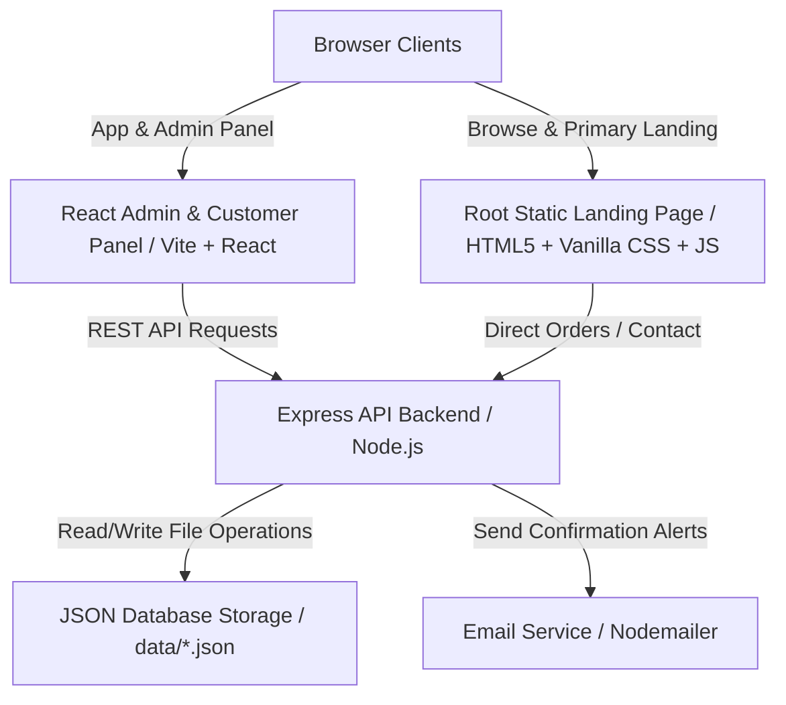

# 💊 E-Pharmacy Platform: Medicine Ordering & Delivery

A premium, full-stack E-Pharmacy web application designed for browsing healthcare products, uploading prescriptions, placing orders, and managing pharmacy workflows. The application features a static customer-facing landing page, a React/Vite-based admin and customer panel, and a Node.js/Express backend powered by a custom JSON-based file database.

---

## 🏗️ Architecture Overview

The application is structured as a monorepo consisting of a static root presentation website and two decoupled workspace services:



---

## ⚡ Core Features

### 🛒 Customer-Facing Landing & Catalog
* **Premium Presentation UI**: A modern, interactive landing page utilizing smooth glassmorphic designs, responsive flex/grid layouts, theme toggling (Light/Dark mode), and interactive wellness widgets (BMI Calculator, Water Intake Tracker).
* **Robust Product Catalog**: Over 40+ items preloaded and categorized into medicines (Rx & OTC), wellness supplements, personal care, and baby care. Features direct keyword filtering, category-based scrolling selectors, and pricing details.
* **Instant WhatsApp Checkout**: Customers can add items to their cart, input shipping details, and auto-generate a pre-filled order draft which can be instantly forwarded to the pharmacy's WhatsApp number for prompt packaging.

### 📝 Prescription Upload (Rx)
* **Prescription Scanning Integration**: A secure portal where customers upload digital images or PDF copies of doctor prescriptions.
* **Backend File Storage**: Utilizes `multer` middleware to store uploaded prescriptions in a secure local upload directory, linking the metadata to active user sessions and database logs.

### 🖥️ Unified Admin & User Panel (React)
* **JWT-Based Authentication**: Secure login flow with JSON Web Tokens protecting private user profiles and admin-only dashboard features.
* **Dynamic Inventory Control**: Admin view to browse, search, and update product pricing/descriptions.
* **Order & Prescription Management**:
  * Real-time monitoring of placed orders.
  * Direct access to download/view uploaded prescription attachments.
  * Processing of incoming contact and support queries.

### ⚙️ Backend API & Services
* **Express Router Architecture**: Decoupled routes handling authentication, product catalogs, order logging, prescription storage, and email dispatching.
* **Lightweight DB Core**: A robust, promise-based local file database using NodeJS `fs/promises` that persists records cleanly in structured JSON files.
* **Nodemailer Integration**: Handles transactional confirmation emails and support messages.

---

## 📁 Repository Structure

```text
├── backend/                  # Node.js + Express API Backend
│   ├── data/                 # JSON Database collection files (orders, products, etc.)
│   ├── database/             # Database connection & seed script (jsonDb.js)
│   ├── middleware/           # Route protection & file upload middlewares
│   ├── routes/               # Express routing modules (auth, products, orders, etc.)
│   ├── uploads/              # Local storage folder for uploaded prescription files
│   ├── server.js             # Main server execution file
│   └── package.json
├── frontend/                 # React + Vite Admin/User Portal
│   ├── src/
│   │   ├── components/       # Shared interface components (Navbar, Footer, ProtectedRoutes)
│   │   ├── pages/            # View pages (Home, Catalog, Checkout, Admin, Auth, MyOrders, etc.)
│   │   ├── index.css         # Styling system
│   │   └── main.jsx          # Entry point
│   ├── vite.config.js
│   └── package.json
├── index.html                # Static storefront/landing page
├── app.js                    # Script managing landing page interactivity & static checkout
├── style.css                 # Global styling for landing page
├── DEPLOYMENT.md             # Multi-platform deployment guide (Render, Vercel)
└── package.json              # Monorepo configuration and script controller
```

---

## 🛠️ Local Development Setup

### 📋 Prerequisites
* **Node.js** (v16 or higher)
* **npm** (v7 or higher)

### 🚀 Quick Start (Concurrent Run)

1. **Install Root and Workspace Dependencies**:
   From the repository root, install dependencies across all workspaces using npm:
   ```bash
   npm install
   ```

2. **Configure Environment Variables**:
   * Create a `.env` file inside the `backend` directory:
     ```env
     PORT=5000
     JWT_SECRET=your_jwt_secret_key_here
     # If you want to use email notifications:
     # SMTP_HOST=smtp.gmail.com
     # SMTP_PORT=587
     # SMTP_USER=your_email@gmail.com
     # SMTP_PASS=your_app_password
     ```
   * Create a `.env` file inside the `frontend` directory:
     ```env
     VITE_API_URL=http://localhost:5000/api
     ```

3. **Run Both Servers Concurrently**:
   Run the dev server, which will boot the Express backend on port `5000` and the React frontend on `5173` concurrently:
   ```bash
   npm run dev
   ```

4. **Verify Application**:
   * Root Static Storefront: open `http://localhost:5173` (or view root `index.html` via live server)
   * React Admin Panel: open `http://localhost:5173`
   * Backend REST API: open `http://localhost:5000`
